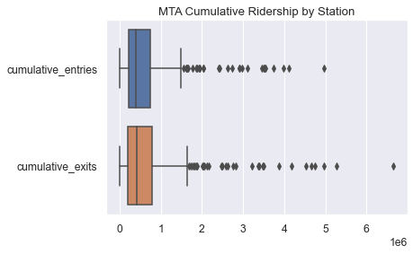

## Analysis of MTA 

As New York City resumes normal life in a 'post-pandemic' world, the Metropolitan Transit Agency is tasked with [keeping riders safe](https://www.wsj.com/articles/how-does-new-york-keep-transit-riders-safe-from-covid-19-trial-and-error-11609678802). This includes monitoring subway stations for overcrowding, which remains a health risk as vaccination efforts are ongoing.  The goal of this project is to better understand where ridership is highest and growing the fastest in order to make decisions for public safety.

To explore the data, I plotted the distribution of cumulative entries and exits by station over the six month period from January to June of 2021 using side-by-side boxplots. The right skew indicates that the majority of subway stations carry a lower volume of passengers (roughly between 200,000 and 1.6 million roughly), while just a few stations carry a high volume. 34th St-Penn station is the busiest station by far, using both entries and exits as metrics. 

The line chart below plots the daily foot traffic (total exits and entries) for the busiest 10 stations, compared to the average of all MTA stations.

.png)

Finally, I plotted total foot traffic per station against a map of the New York City's subway-connected boroughs. The map reveals that the busiest stations are concentrated in Manhattan. Indeed, the 8 busiest stations by foot traffic (34th St-Penn through Union Sq-14th St) aree all located in Manhattan.

This result suggests that the MTA may need to focus resources on Manhattan to prevent overcrowding as subway transit becomes more populated in the months following New York City's re-opening. 
